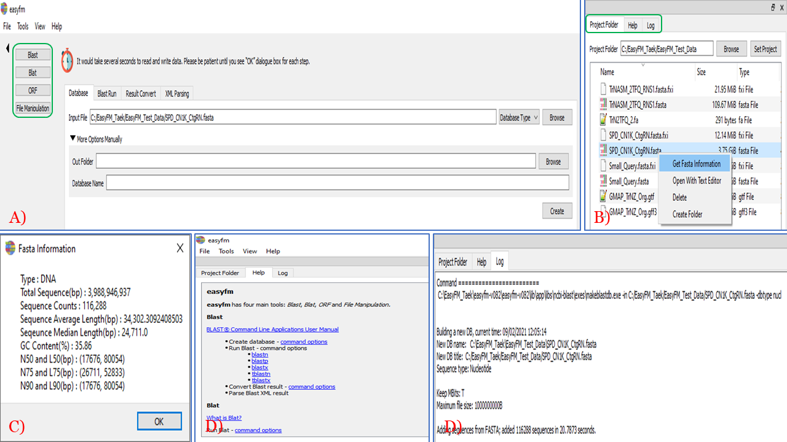
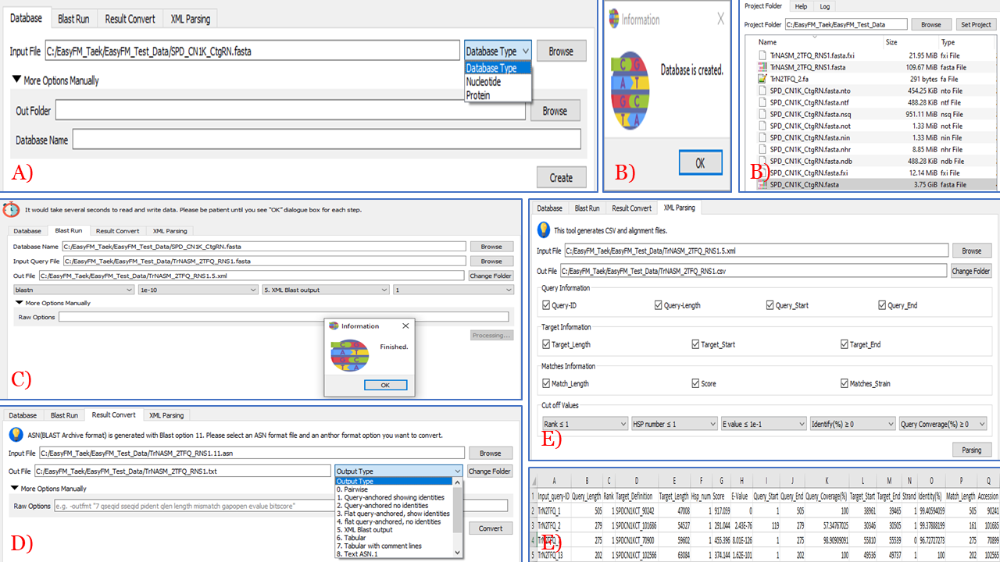
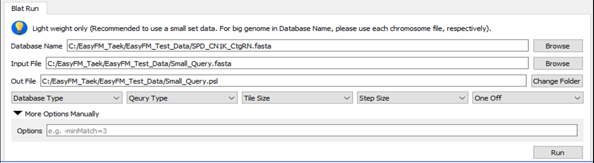
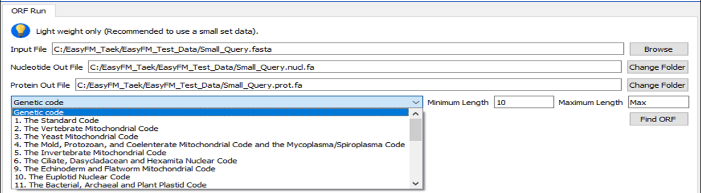
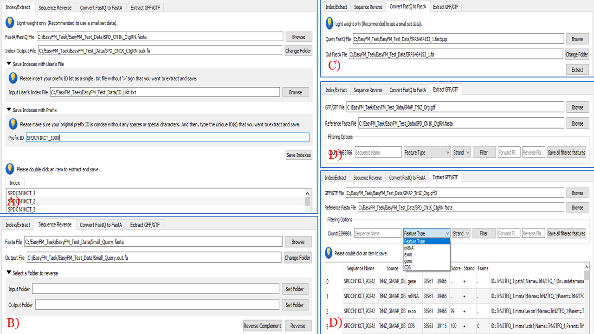

# easyfm: An easy software suite for file manipulation of Next Generation Sequencing data on desktops

Hyungtaek Jung, Brendan Jeon and Daniel Ortiz-Barrientos

----

## 1 Brief Background

**easy** **f**ile **m**anipulation (**_easyfm_**) is a lightweight suite of software tools for working with Next Generation Sequencing datasets (e.g. fastq, fasta, gff, and gtf) on desktops and laptops. We (Brendan Jeon and Hyungtaek Jung @ The University of Queensland, Australia) initially started this project to provide a graphical environment for biologists using NGS data who are less experienced in coding and command lines. As a lightweight (but powerful) desktop/laptop application, we have tested it for short (e.g. Illumina) and long-read data (PacBio and Oxford Nanopore) focusing on a small and medium scale .fastq, .fasta, .gff, and .gtf files that can be widely used to the greater research community.

## 2 Citation

Hyungtaek Jung, Brendan Jeon, Daniel Ortiz-Barrientos: **_easyfm_**: An **easy** software suite for **f**ile **m**anipulation of Next Generation Sequencing data on desktops, PLoS Computational Biology Sumbitted.

## 3 Contents

* STABLE
* INSTALLATION
* LICENSE 
* GETTING STARTED
* FAQ
* WIKI PAGE
* AUTHOR
* COPYRIGHT

### 3.1 STABLE (version 1.0.4)

Release date: September 2021 
**_easyfm_** is made up of six programs and packages (See LICENSE), mainly written in Python 3.7+.

### 3.2 INSTALLATION
Windows: Please download the program from [this link](https://github.com/TaekAndBrendan/easyfm/raw/main/windows/easyfm.7z). Extract 'easyfm.7z' with [7z](https://www.7-zip.org/download.html) and double-click easyfm.exe. 

**!! Please note**, if there are any antivirus issues, please follow this step (e.g. The University of Queensland): 1) click "undo action token" from "other actions", 2) click "start undo", and 3) re-install the program. Any other issues, we highly encourage users to use the [Issues](https://github.com/TaekAndBrendan/easyfm/issues). 

Linux or Mac: To install **_easyfm_**, run the following series of commands.

~~~
# Create the virtual environment
python -m venv venv 
source venv/bin/activate

# Get source
git clone https://github.com/TaekAndBrendan/easyfm.git
cd easyfm

# Install packages
# pip -m pip install --upgrade pip # if you get errors, try to upgrade pip 
pip install -r requirements.txt 

# Run
python easyfm.py
~~~

### 3.3 License

**_easyfm_** is provided under the MIT license and is based on other open-source software and Python packages:

* [Biopython](https://biopython.org/wiki/Documentation)  for biological data computation
* [PyQt5](https://pypi.org/project/PyQt5/) for a Python binding of the cross-platform GUI toolkit Qt
* [gffutils](https://github.com/daler/gffutils) for working with and manipulating the [GFF](https://seqan.readthedocs.io/en/master/Tutorial/InputOutput/GffAndGtfIO.html), [GFF3](https://github.com/The-Sequence-Ontology/Specifications/blob/master/gff3.md) and [GTF](https://biocorecrg.github.io/PhD_course/gtf_format.html) format files
* [Pyfastx](https://github.com/lmdu/pyfastx) for fast random access to sequences from plain and gzipped [FASTA](https://www.maplesoft.com/support/help/Maple/view.aspx?path=Formats/FASTA) and [FASTQ](https://www.maplesoft.com/support/help/maple/view.aspx?path=Formats%2FFASTQ) files
* [BLAST+](https://blast.ncbi.nlm.nih.gov/Blast.cgi?CMD=Web&PAGE_TYPE=BlastDocs&DOC_TYPE=Download) and [Ensembl](https://m.ensembl.org/info/docs/webcode/mirror/tools/blast.html) for a sequence similarity search
* [BLAT](https://genome.ucsc.edu/goldenPath/help/blatSpec.html) and [Ensembl](https://m.ensembl.org/info/docs/webcode/mirror/tools/blast.html) for rapidly aligning long sequences and gapped mapping to the genome

### 3.4 GETTING STARTED

**_easyfm_**, mainly written in Python 3.7+, has two specific features: a working module and a secondary window. The work module enables end-to-end file manipulation (with a simple mouse click)— post-processing, filtering, extracting, format conversion, and final result calculations—by integrating four Python libraries and two executable programs with additional visualisation and conversation tools (mostly many well-established open-source Python packages). The secondary window (Project Folder, Help and Log) is mainly designed to support the major work module.

#### 3.4.1 Secondary Window (SW)

**Figure 1: Integration of secondary window with main work module of _easyfm_.**

 A) Four main work modules (green box) to BLAST, BLAT, ORF, and File Manipulation.
 B) Three secondary modules (green box) to assist with main work modules and extra features using a right mouse click.
 C) Fasta file stats information accessed from B.
 D) Adjustable secondary window (Help and Log) on the top and bottom.

* **SW Step 1**: Browse and select your work folder (Set Project) via the Project Folder tab and transfer all files that you want to import and export (Fig 1A and B). Once browsed and selected, click OK. This will be your work folder for all in-/out-put files. It is highly recommended to make sure your working directory is correct before moving on to the next steps, and before using any work module options.
* **SW Step 2**: Select a fasta file to see its summary information by right clicking the mouse and choosing ‘Get Fast Information’. Alternatively, from the right click window you can open the file with text editors, delete the file and create a file/folder (Fig 1C and D).
* **SW Step 3**: To see further assistance for each module, click Help (Fig 1D).
* **SW Step 4**: To see real-time log reporting and monitoring for an executed job, click Log (Fig 1D).
* **SW Step 5**: This secondary window can be adjustable in any four corners on the desktop by using the mouse (Fig 1).

#### 3.4.2 Work Module

These are separated into four modules based on the type of file that is to be analysed.

* **Basic Local Alignment Search Tool (BLAST)**       # All BLAST output file formats including a xml file parsing feature
* **BLAST-Like Alignment Tool (BLAT)**                # BLAT a psl file format
* **Open Reading Frame (ORF)**                        # Fasta file format
* **File Manipulation**                               # Fastq, fasta, gff, and gtf file format

Each of these modules contains many user-friendly navigation/interactive modes for manipulating, filtering, sorting, converting, or analysing these types of files. Check out the documentation for each module for more information about the GUI-based interactive modes.

##### 3.4.2.1 BLAST Module

The BLAST module is designed to easily format and run searches on a local computer and database. Since any fasta files can be used for BLAST functions without relying on NCBI web server, running local BLAST via easyfm shows great advantages to use customized databases including your own unpublished genome and transcriptome sequences that are not available on GenBank. Figure 2 shows an easy step for each stage for the BLAST module.

**Figure 2: User-friendly standalone work modules in _easyfm_: BLAST module.**

Most steps include further manual options for a user-specified parameter.

A) Create a local database by selecting nucleotide or protein.
B) Job completion message and created database files listed in a secondary window.
C) Run local BLAST with multiple features including output type.
D) Convert from a BLAST archive file to a different output format.
E) A BLAST xml file parsing with multiple options for a csv file.

**Note: Please make sure all files are in the designated folder. Not sure, please see SW Step 1.**

* **BLAST Step 1**: Click Blast first and it will indicate Database (Fig 2A).
* **BLAST Step 2**: Select your input file from the dialogue box to format the local database. You can navigate the files via Browse (Not sure, please see SW Step 1). If your target fasta file to create a local Blast Database is in the Project Folder, click the right mouse to see more functions (e.g. Fasta stats) in the Secondary Window. Please make sure to select a proper sequence type, Nucleotide or Protein (Fig 2A).
* **BLAST Step 3**: Click Create to generate the local database. If you need more specific options, feel free to use “More Options Manually” (Fig 2B).
* **BLAST Step 4**: Once completed, all necessary files will be produced in the Project Folder.
* **BLAST Step 5**: To run local BLAST, click Run (Fig 2C).
* **BLAST Step 6**: Select the proper Database Name generated from BLAST Step 2. And, select your input query file (fasta file format) to run against the local BLAST database that you created in BLAST Step 2 and 3. If necessary, feel free to use the Browse function. While the Out File can be automatically linked to the Project Folder, it is possible to change its destination using the Change Folder. However, it is highly recommended to use the Project Folder for all analyses.
* **BLAST Step 7**: More BLAST options can be selected from the top-down menus of Tools, E-value, Output Type, and CPU. If necessary, users can provide further options via More Options Manually. Click Run to generate the local BLAST outcome. Once completed, all necessary files will be produced in the Project Folder unless users indicated the different output folder from BLAST Step 6 or SW Step1 (Fig 2C).
* **BLAST Step 8**: If users selected BLAST archive format (ASN.1) from BLAST Step 7 but want to convert a different BLAST output format, please use the Convert option. Please see the Change Folder option in BLAST Step 7 (Fig 2D). 
* **BLAST Step 9**: If users generated a BLAST xml file (internally via easyfm or externally from HPC) but want to parse it, please use the Parsing option. Both input and output files can be selected via Browse and Change Folder. And, further parsing parameters can be checked or unchecked including Rank, HSP number, E-value, Identify, and Query Coverage options (Fig 2E).

##### 3.4.2.2 BLAT Module

As BLAST, this is also designed to easily run searches on a local computer for any fasta files. If you are unclear whether your query sequences should be good for BLAST or BLAT, please see the difference between BLAST and BLAT at [this link](https://genome.ucsc.edu/FAQ/FAQblat.html). Figure 3 shows an easy step for each stage for BLAT module.

**Figure 3: User-friendly standalone work modules in _easyfm_: BLAT module.**

Most steps include further manual options for a user-specified parameter. Create and run a local database with multiple options for a psl file that can open with text editor and Excel.

* **BLAT Step 1**: Click Blat first and it will indicate run.
* **BLAT Step 2**: Select your Database Name. This will be your target fasta file. And, select your input query file (fasta file format) to run against the local BLAT database. If necessary, feel free to use the Browse function. While the Out File can be automatically linked to the Project Folder, it is possible to change its destination using the Change Folder (Not sure, please see SW Step 1).
* **BLAT Step 3**: More BLAT options can be selected from the top-down menus of DB Type, Query Type, TileSize, StepSize, and OneOff. If necessary, users can provide further options via More Options Manually. Click Run to generate the local BLAT outcome. Once completed, all necessary files will be produced in the Project Folder unless users indicated the different output folder from BLAT Step 2.

##### 3.4.2.3 ORF Module
It is designed to easily run searches on a local computer for any fasta files to find an open reading frame (translated into amino acids containing no stop codons) performing a six-frame translation of a nucleotide given a particular genetic code, finding all ORFs possible. Since any fasta files can be used for ORF searches without relying on webservers or databases and limited query sequence length, running local ORF via easyfm shows great advantages to use your own unpublished genome and transcriptome sequences that are not available on the public database. Figure 4 shows an easy step for each stage for ORF module.

**Figure 4: User-friendly standalone work modules in _easyfm_: ORF module.**

Most steps include further options for a user-specified parameter. Run ORF with different genetic codes for coding and protein sequences. A FASTA format output file of nucleotide and protein from a six-frame translation will be generated.

* **ORF Step 1**: Click ORF first and it will indicate run.
* **ORF Step 2**: Select your target fasta file to run ORF. If necessary, feel free to use the Browse function. While the two Out Files (Nucleotide and Protein) can be automatically linked to the Project Folder, it is possible to change its destination using the Change Folder (If you are not sure, please see SW Step 1).
* **ORF Step 3**: More ORF options can be selected from the top-down menus of Genetic Code, and Minimum and Maximum length. Click Find ORF to generate the outcome. Once completed, all necessary files will be produced in the Project Folder unless users indicated the different output folder from ORF Step 2.

##### 3.4.2.4 File Manipulation Module

It is designed to easily index, extract (indexed ID with its sequence) and convert format on a local computer. Even the FASTQ file can be converted to the FASTA file and the given FASTA file can execute easily change its direction via Reverse Complement and Reverse. Since any FASTA/Q files can be used for File Manipulation functions without relying on a web server or a command-line, running local File Manipulation via easyfm shows great advantages to enhance user-friendliness including your own unpublished genome and transcriptome sequences that are not available on the public database. To accept the wide applications, easyfm File Manipulation allows users to easily manipulate (including filtering and extracting sequence regions) and consolidate from GFF and GTF files if its corresponding reference genome/transcriptome sequences are present. Figure 5 shows an easy step for each stage for the File Manipulation module.

**Figure 5: User-friendly standalone work modules in _easyfm_: File Manipulation module.**

Most steps include further individual selection by manually saving as a FASTA file for a user-specified sequence ID.
A) Select a FASTA file to index.
B) Convert nucleotide sequences for reverse complement or just reverse sequence.
C) Convert and extract from FASTQ to FASTA.
D) Extract sequences with specific IDs from indexed reference FASTA and GFF3/GTF files with different features.

* **FM Step 1**: Click File Manipulation first and it will indicate Index/Extract (Fig 5A). This example will be focused on a fasta file only.
* **FM Step 2**: Select your input file from the dialogue box to index. You can navigate the files via Browse (Not sure, please see SW Step 1). If your target fasta/fastq file is in the Project Folder, click the right mouse to see more functions (e.g. Fasta stats) in the Secondary Window. Once your target file is fully uploaded, the indexed file will be available at the below table (Fig 5A). If you want to extract and save individually, select an item that you are after.
* **FM Step 3**: If you have a list of IDs that you want to extract and save as a single multi-fasta file, please provide your prefix IDs as a text file with “>” sign via “Save Indexes with User’s File”. And then, click “Save indexes”. Alternatively, please provide the prefix IDs that you want to extract and save via “Saves Indexes with Prefix” (Fig 5A). And then, click “Save filtered indexes”.
* **FM Step 4**: Select your input fasta file that you want to reverse/reverse complement DNA sequences. While the in/output files/folders can be automatically linked to the Project Folder, it is possible to change its destination using the Set Folder (Not sure, please see SW Step 1). And then, click “Reverse Complement” or “Reverse” (Fig 5B).
* **FM Step 5**: Select your input fastq file that you want to convert as a fasta format. While the input/output files/folders can be automatically linked to the Project Folder, it is possible to change its destination using the Change Folder (Not sure, please see SW Step 1). And then, click “Extract” (Fig 5C). 
* **FM Step 6**: Select your GFF/GTF file along with the reference fasta file that you want to extract as a fasta format. The in/output files/folders will be automatically linked to the Project Folder (Not sure, please see SW Step 1). Once your target GFF/GTF and its reference fasta file is fully uploaded, the indexed file will be available at the below table (Fig 5D). If you want to extract and save individually, select an item that you are after.
* **FM Step 7**: If you extract manually, please use “Filtering Options”. This will allow you to extract items by Sequence Name, Feature Type (exon, CDS, mRNA, and gene), and Strand. And then, click “Filter” to see your filtered items. If satisfied, click “Save filtered features” (Fig 5D).
* **FM Step 8**: If you extract manually with flanking regions, please use “Filtering Options” too. Select your target “Sequence Name” and put a numeric number for “Forward” and “Reverse” that you want to extract as a fasta format. And then, click “Save filtered features” (Fig 5D).

### 3.5 FAQ
We encourage users to use the [Issues](https://github.com/TaekAndBrendan/easyfm/issues). For further enquiries (including suggestion), you can also contact the **_easyfm_** development team [Brendan Jeon](mailto:b.jeon@uq.edu.au) and [Hyungtaek Jung](mailto:hyungtaek.jung@uq.edu.au).

### 3.6 WIKI PAGE

Please see GitHub page.

### 3.7 AUTHOR

[Hyungtaek Jung](mailto:hyungtaek.jung@uq.edu.au) and [Brendan Jeon](mailto:b.jeon@uq.edu.au).

### 3.8 COPYRIGHT

The full **_easyfm_** is distributed under the MIT license.
